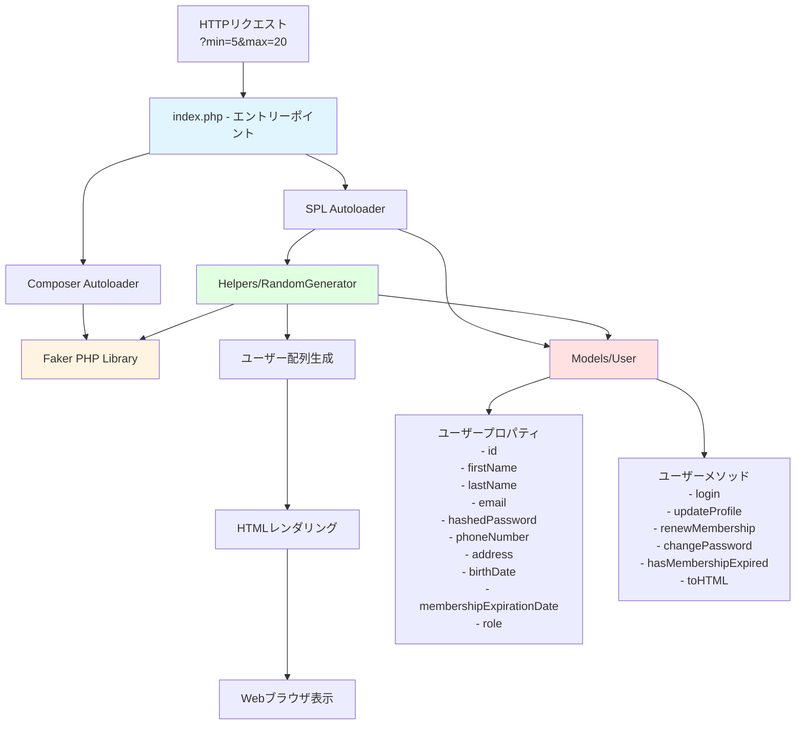
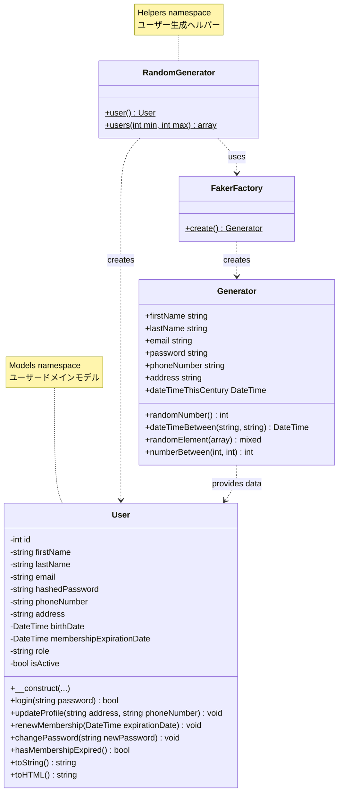
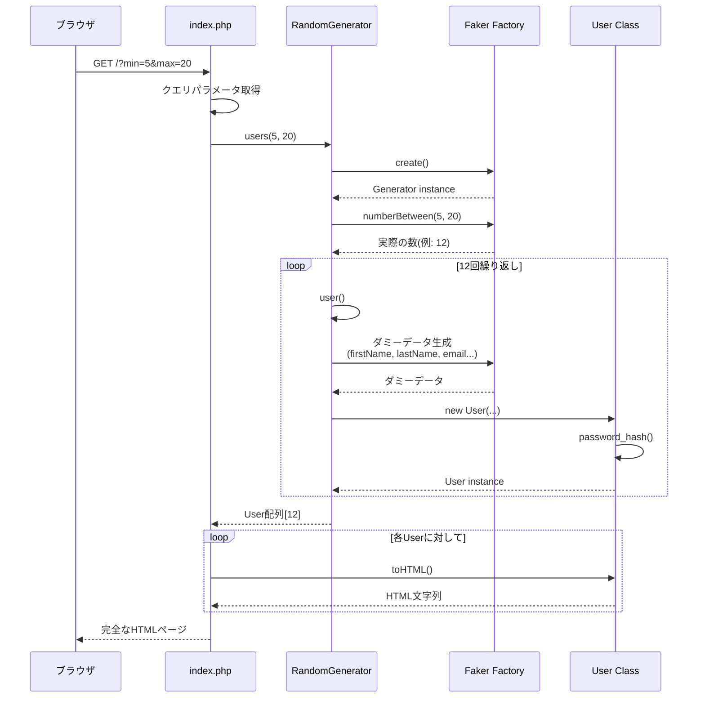
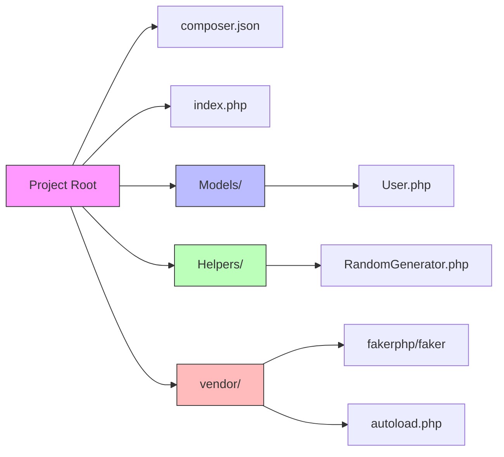

# User Lorem Ipsum

## 📖 概要

User Lorem Ipsumは、Faker PHPライブラリを活用してランダムなユーザーデータを生成・表示するPHPプロジェクトです。Lorem Ipsum（ダミーテキスト）のように、開発やテスト段階で必要となる現実的なユーザー情報を簡単に生成できるツールとして設計されています。

このプロジェクトは、オブジェクト指向プログラミング（OOP）の原則に基づいて構築されており、MVCパターンの一部を実装しています。Composerを使用した依存関係管理、PSR-4オートローディング、そして動的なデータ生成を学習できる実践的な教材として活用できます。

## ✨ 特徴

- **動的ユーザー生成**: クエリパラメータを使用して生成するユーザー数を柔軟に指定可能
- **Faker PHP統合**: 現実的で多様なダミーデータを自動生成
- **オブジェクト指向設計**: クリーンなクラス構造とカプセル化の実装
- **PSR-4準拠**: 標準的なオートローディング規約に従った名前空間設計
- **HTMLレンダリング機能**: 生成されたユーザー情報をWebページ上に視覚的に表示
- **パスワードハッシング**: セキュアなパスワード管理の実装
- **メンバーシップ管理**: 有効期限の追跡と検証機能
- **軽量でシンプル**: 最小限の依存関係で素早くセットアップ可能

## 🎓 このプロジェクトを通して学べること・習得できること

### 1. オブジェクト指向プログラミング（OOP）の基礎と実践

**カプセル化（Encapsulation）**
- プライベートプロパティの適切な使用
- Getterメソッドを介したデータアクセスの制御
- 内部状態の保護とデータ整合性の維持

**クラス設計の原則**
- 単一責任の原則（Single Responsibility Principle）: `User`クラスはユーザーのデータと振る舞いのみを管理
- Helperクラスパターン: `RandomGenerator`による関数の静的メソッド化
- 適切なコンストラクタの設計とオブジェクトの初期化

### 2. 名前空間とオートローディング

**PSR-4オートローディング標準**
```php
// 名前空間とディレクトリ構造の対応
Models\User → Models/User.php
Helpers\RandomGenerator → Helpers/RandomGenerator.php
```

**SPL Autoloaderの実装**
- `spl_autoload_register()`を使用したカスタムオートローダー
- Composerの`autoload.php`との連携
- クラスの遅延読み込みによるパフォーマンス最適化

### 3. Composerによる依存関係管理

**パッケージマネージャーの使用**
- `composer.json`による依存関係の定義
- セマンティックバージョニング（`^1.24`）の理解
- ベンダーディレクトリの管理と.gitignoreの重要性

### 4. データ生成とテストデータの作成

**Faker PHPライブラリの活用**
- リアルなダミーデータの生成技術
- ロケールの設定と多言語対応
- 様々なデータ型の生成（名前、メール、住所、日付など）

### 5. セキュリティのベストプラクティス

**パスワードハッシング**
```php
password_hash($password, PASSWORD_DEFAULT);  // BCrypt/Argon2による暗号化
password_verify($password, $hash);           // 安全な検証
```

**重要な学習ポイント**
- 平文パスワードの保存がなぜ危険なのか
- レインボーテーブル攻撃とSalt
- PHPのビルトイン関数を使った安全な実装

### 6. 日付・時刻処理

**DateTimeクラスの実践的使用**
- オブジェクト指向的な日付操作
- 日付の比較とビジネスロジック（有効期限チェック）
- フォーマット変換と文字列化

### 7. 型システムとタイプヒンティング

**厳密な型指定**
```php
public function __construct(
    int $id,
    string $firstName,
    DateTime $birthDate
)
```

**戻り値の型宣言**
- プリミティブ型（`string`, `int`, `bool`）
- クラス型（`DateTime`, `User`）
- `void`型の適切な使用

### 8. HTTPプロトコルとWebアプリケーション基礎

**GETパラメータの処理**
```php
$min = $_GET['min'] ?? 5;  // Null合体演算子
```

**クエリ文字列の活用**
- `?min=1&max=10`による動的な挙動制御
- URLパラメータのバリデーション（実装の改善余地）

### 9. HTML生成とテンプレート処理

**PHPによる動的HTMLレンダリング**
- ショートエコータグ（`<?= ?>`）の使用
- `sprintf()`による安全な文字列フォーマット
- HTMLとPHPの分離と統合のバランス

### 10. ソフトウェア設計パターン

**Factoryパターン**
```php
Factory::create()  // Fakerのファクトリー
self::user()       // 静的ファクトリーメソッド
```

**Static Utilityパターン**
- `RandomGenerator`クラスの静的メソッド設計
- インスタンス化不要なヘルパー関数群

### 概念図



### クラス関係図



### データフロー図



### 学習の進め方

1. **基礎レベル**: クラスの読解、オートローディングの理解
2. **中級レベル**: Faker APIの活用、独自のヘルパーメソッド追加
3. **上級レベル**: データベース連携、バリデーション実装、REST API化
4. **発展課題**: 
   - CSVエクスポート機能の追加
   - JSONレスポンスモードの実装
   - ページネーション機能
   - フロントエンド（React/Vue）との統合

## 🛠️ 必要条件

- **PHP**: 8.0以上（型宣言、名前空間機能を使用）
- **Composer**: 2.0以上（依存関係管理）
- **Webサーバー**: 以下のいずれか
  - PHP組み込みサーバー（開発用）
  - Apache 2.4+ with mod_php
  - Nginx with PHP-FPM
- **その他**:
  - Git（クローン用）
  - モダンなWebブラウザ（表示確認用）

## 📦 インストール手順

### 1. リポジトリのクローン

```bash
git clone https://github.com/yourusername/user-lorem-ipsum.git
cd user-lorem-ipsum
```

### 2. 依存関係のインストール

Composerを使用してFaker PHPライブラリをインストールします。

```bash
composer install
```

### 3. プロジェクトの起動

PHP組み込みサーバーを使用して起動します。

```bash
php -S localhost:8000
```

サーバーが起動したら、ブラウザで以下にアクセスします：

```
http://localhost:8000
```

## 💻 使用方法

### 基本的な使い方

ブラウザで`http://localhost:8000`にアクセスすると、5〜20人のランダムなユーザープロファイルが表示されます。

### クエリパラメータによるカスタマイズ

生成するユーザー数の範囲を指定できます：

```bash
# 1〜10人のユーザーを生成
http://localhost:8000?min=1&max=10

# 50〜100人のユーザーを生成
http://localhost:8000?min=50&max=100

# 固定で5人生成（minとmaxを同じ値に）
http://localhost:8000?min=5&max=5
```

### コード内での使用例

プロジェクトをライブラリとして他のPHPコードから使用する場合：

```php
<?php
require_once 'vendor/autoload.php';

use Helpers\RandomGenerator;
use Models\User;

// 単一ユーザーの生成
$user = RandomGenerator::user();
echo $user->toString();

// 複数ユーザーの生成
$users = RandomGenerator::users(10, 20);

foreach ($users as $user) {
    // ユーザー情報の処理
    if ($user->hasMembershipExpired()) {
        echo "メンバーシップが期限切れです\n";
    }
}

// パスワードの検証
if ($user->login('password123')) {
    echo "ログイン成功\n";
}
```

## 🎯 機能一覧

### ユーザー生成機能
- ランダムな個人情報の生成（名前、メール、電話番号、住所）
- 生成数の範囲指定（minとmaxパラメータ）
- 一意のユーザーIDの割り当て

### ユーザー管理機能
- **認証**: パスワードハッシュとログイン検証
- **プロフィール更新**: 住所と電話番号の変更
- **メンバーシップ管理**: 有効期限の更新と確認
- **パスワード変更**: セキュアな再ハッシング

### 表示機能
- HTML形式でのユーザーカード表示
- テキスト形式での情報出力（`toString()`）
- レスポンシブ対応可能な構造

### データ属性
- ユーザーID（整数）
- 基本情報（氏名、メールアドレス）
- 連絡先（電話番号、住所）
- 日付情報（生年月日、メンバーシップ有効期限）
- 役割（Role）: admin / user / editor
- アクティブステータス

## 🔧 技術スタック

### バックエンド
- **PHP 8.0+**: サーバーサイド言語
  - 型宣言（Type Declarations）
  - 名前空間（Namespaces）
  - Null合体演算子（Null Coalescing Operator）
  - password_hash/verify関数

### 依存関係管理
- **Composer**: PHPパッケージマネージャー
  - PSR-4オートローディング
  - 依存関係解決

### ライブラリ
- **FakerPHP/Faker ^1.24**: ダミーデータ生成
  - 多様なデータタイプのサポート
  - ロケール対応
  - カスタマイズ可能なプロバイダー

### フロントエンド
- **HTML5**: マークアップ
- **CSS**: スタイリング（拡張可能）
- **PHP Template**: 動的コンテンツ生成

### アーキテクチャパターン
- **MVC（部分的）**: Model（User）とView（HTML）の分離
- **Factory Pattern**: RandomGeneratorによるオブジェクト生成
- **Static Utility Pattern**: ヘルパークラスの設計

## 📚 追加資料

### プロジェクト構成図



### 推奨される学習リソース

1. **PHP公式ドキュメント**
   - [PHP Manual - Classes and Objects](https://www.php.net/manual/en/language.oop5.php)
   - [PHP Manual - Namespaces](https://www.php.net/manual/en/language.namespaces.php)
   - [PSR-4: Autoloader](https://www.php-fig.org/psr/psr-4/)

2. **Faker PHP**
   - [公式ドキュメント](https://fakerphp.github.io/)
   - [GitHub Repository](https://github.com/FakerPHP/Faker)

3. **Composer**
   - [Composer Getting Started](https://getcomposer.org/doc/00-intro.md)

### 今後の拡張案

- **データベース統合**: MySQL/PostgreSQLへの永続化
- **REST API化**: JSON形式でのレスポンス
- **認証システム**: セッション管理とJWT
- **フロントエンド強化**: React/Vueとの連携
- **テストスイート**: PHPUnitによる単体テスト
- **Docker化**: コンテナ環境での実行
- **CI/CD**: GitHub Actionsによる自動テスト

## 🤝 貢献方法

このプロジェクトへの貢献を歓迎します！以下の方法で貢献できます：

### バグ報告

バグを発見した場合は、GitHubのIssuesセクションで報告してください。以下の情報を含めてください：

- バグの詳細な説明
- 再現手順
- 期待される動作と実際の動作
- 使用しているPHP/Composerのバージョン
- エラーメッセージ（あれば）

### 機能提案

新しい機能のアイデアがある場合：

1. Issuesで機能提案を作成
2. ユースケースと実装のメリットを説明
3. 可能であればモックアップやコード例を提供

### プルリクエスト

コードの貢献手順：

1. このリポジトリをフォーク
2. 新しいブランチを作成（`git checkout -b feature/amazing-feature`）
3. 変更をコミット（`git commit -m 'Add some amazing feature'`）
4. ブランチにプッシュ（`git push origin feature/amazing-feature`）
5. プルリクエストを作成

### コーディング規約

- PSR-12コーディングスタイルに準拠
- 型宣言を適切に使用
- 意味のある変数名とメソッド名
- コメントで複雑なロジックを説明
- 既存のコードスタイルに合わせる

### 貢献のアイデア

- 追加のユーザープロパティ実装
- CSVエクスポート機能
- ユーザー検索・フィルタリング機能
- データバリデーション強化
- 国際化対応（i18n）
- ドキュメントの改善・翻訳

## 📄 ライセンス

このプロジェクトはMITライセンスの下で公開されています。

```
MIT License

Copyright (c) 2026 User Lorem Ipsum Project

Permission is hereby granted, free of charge, to any person obtaining a copy
of this software and associated documentation files (the "Software"), to deal
in the Software without restriction, including without limitation the rights
to use, copy, modify, merge, publish, distribute, sublicense, and/or sell
copies of the Software, and to permit persons to whom the Software is
furnished to do so, subject to the following conditions:

The above copyright notice and this permission notice shall be included in all
copies or substantial portions of the Software.

THE SOFTWARE IS PROVIDED "AS IS", WITHOUT WARRANTY OF ANY KIND, EXPRESS OR
IMPLIED, INCLUDING BUT NOT LIMITED TO THE WARRANTIES OF MERCHANTABILITY,
FITNESS FOR A PARTICULAR PURPOSE AND NONINFRINGEMENT. IN NO EVENT SHALL THE
AUTHORS OR COPYRIGHT HOLDERS BE LIABLE FOR ANY CLAIM, DAMAGES OR OTHER
LIABILITY, WHETHER IN AN ACTION OF CONTRACT, TORT OR OTHERWISE, ARISING FROM,
OUT OF OR IN CONNECTION WITH THE SOFTWARE OR THE USE OR OTHER DEALINGS IN THE
SOFTWARE.
```

詳細については、[LICENSE](LICENSE)ファイルを参照してください。

---

**プロジェクト作成日**: 2026年1月11日  
**最終更新日**: 2026年1月11日  
**メンテナンス状態**: アクティブ  

質問や提案がある場合は、お気軽にIssuesを開いてください！
