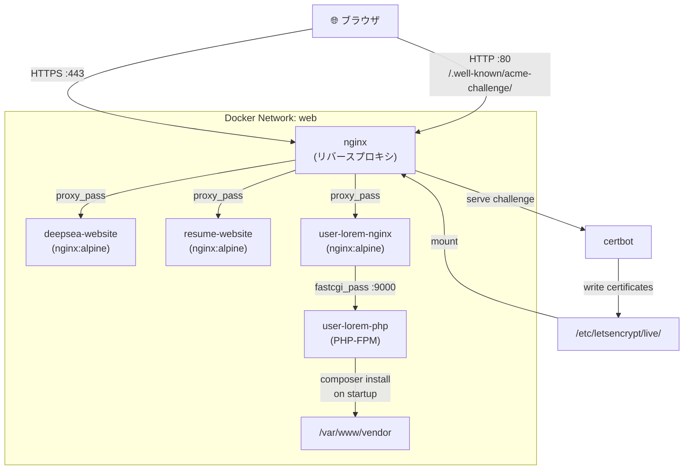

# Docker × Nginx × Let's Encrypt 構成で ERR_CONNECTION_REFUSED が出たときにやること 🐳

## リード文

「昨日まで動いてたのに、ブラウザが `ERR_CONNECTION_REFUSED` を返すようになった」——
そんな経験はありませんか？

この記事では、**Docker + Nginx リバースプロキシ + Let's Encrypt（certbot）** の構成で起きやすい
接続拒否の原因を体系的に整理し、実際の設定ファイルと手順を使って解決方法を解説します。
さらに、PHP コンテナで `vendor/autoload.php` が消える問題の根本対処まで扱います。

---

## 前提知識

| 技術 | 前提 |
|---|---|
| Docker / Docker Compose | `docker compose up` が使えるレベル |
| Nginx | `server {}` ブロックの読み書きができる |
| Let's Encrypt | certbot で証明書を取得したことがある |
| PHP / Composer | `composer install` の役割を知っている |

---

## 本文

### Context（背景・問題意識）

以下のような multi-service 構成を Docker Compose で運用していたとします。

```
nginx（リバースプロキシ）
├── deepsea-website  → deepsea.example.com
├── resume-website   → resume.example.com
└── user-lorem-nginx → user-lorem-ipsum.example.com
         └── user-lorem-php（PHP-FPM）
```

既存の `deepsea` / `resume` は問題なく動いていたのに、
**`user-lorem-ipsum` を追加したタイミングで nginx 自体が起動しなくなり、全ドメインが `ERR_CONNECTION_REFUSED` になった。**

---

### Core Concept（中核となる考え方）

`ERR_CONNECTION_REFUSED` は HTTP エラーではなく **TCP レベルのエラー** です。
つまり「サーバーとの接続確立 (SYN/ACK) すら失敗している」状態です。

> **ブラウザが 4xx/5xx を返せるのは、そもそも nginx が動いているとき。**
> nginx 自体が起動に失敗していれば、ポートに誰も待受けておらず `ERR_CONNECTION_REFUSED` になります。

nginx が起動に失敗する主な原因は 2 つです。

| 原因 | 症状 |
|---|---|
| ① 設定ファイルで参照している SSL 証明書ファイルが存在しない | `[emerg] cannot load certificate` |
| ② `proxy_pass` の upstream ホストが Docker ネットワーク上で名前解決できない | `[emerg] host not found in upstream` |

---

### 実装例（コード付き）

#### 問題①：SSL 証明書が未発行なのに conf で参照している

新しく追加した `user-lorem-ipsum.conf` が最初から 443 ブロックを持っていました。

```nginx
# ❌ 証明書を発行する前からこれを書くと nginx が起動しない
server {
    listen 443 ssl;
    server_name user-lorem-ipsum.example.com;

    ssl_certificate /etc/letsencrypt/live/user-lorem-ipsum.example.com/fullchain.pem;
    ssl_certificate_key /etc/letsencrypt/live/user-lorem-ipsum.example.com/privkey.pem;
    ...
}
```

**修正手順：一時的に HTTP のみにして certbot を通す**

```nginx
# ✅ Step1: 証明書なしで nginx を起動させるため、80 のみにする
server {
    listen 80;
    server_name user-lorem-ipsum.example.com;

    location /.well-known/acme-challenge/ {
        root /var/www/certbot;
    }

    location / {
        proxy_pass http://user-lorem-nginx;
        proxy_set_header Host $host;
        proxy_set_header X-Real-IP $remote_addr;
    }
}
```

```bash
# nginx を再起動
docker compose up -d nginx

# certbot で証明書を発行
docker compose run --rm certbot certonly \
  --webroot -w /var/www/certbot \
  -d user-lorem-ipsum.example.com \
  --email your@email.com --agree-tos --no-eff-email
```

証明書が取得できたら、`deepsea` / `resume` と同じ構成に書き直します。

```nginx
# ✅ Step2: HTTPS ブロックを追加（最終形）
server {
    listen 80;
    server_name user-lorem-ipsum.example.com;

    location /.well-known/acme-challenge/ {
        root /var/www/certbot;
    }

    return 301 https://$host$request_uri;
}

server {
    listen 443 ssl;
    server_name user-lorem-ipsum.example.com;

    ssl_certificate /etc/letsencrypt/live/user-lorem-ipsum.example.com/fullchain.pem;
    ssl_certificate_key /etc/letsencrypt/live/user-lorem-ipsum.example.com/privkey.pem;

    location /.well-known/acme-challenge/ {
        root /var/www/certbot;
    }

    location / {
        proxy_pass http://user-lorem-nginx;
        proxy_set_header Host $host;
        proxy_set_header X-Real-IP $remote_addr;
    }
}
```

---

#### 問題②：nginx が upstream のコンテナを名前解決できない

Docker Compose のネットワーク設定が噛み合っていませんでした。

```yaml
# ❌ Before: nginx が web ネットワークに入っていない
services:
  nginx:
    build: ./nginx
    ports:
      - "80:80"
      - "443:443"
    # networks が未指定 → デフォルトネットワーク

  user-lorem-nginx:
    image: nginx:alpine
    networks:
      - web  # 別のネットワーク

networks:
  web:
    driver: bridge
```

`proxy_pass http://user-lorem-nginx;` と書いても、
nginx コンテナから `user-lorem-nginx` という名前が解決できず、`[emerg] host not found` で落ちます。

```yaml
# ✅ After: 全サービスを web ネットワークに統一する
services:
  nginx:
    build: ./nginx
    ports:
      - "80:80"
      - "443:443"
    volumes:
      - ./certbot/conf:/etc/letsencrypt
      - ./certbot/www:/var/www/certbot
    depends_on:
      - deepsea-website
      - resume-website
    networks:
      - web      # ← 追加

  deepsea-website:
    build: ./deepsea-website
    networks:
      - web      # ← 追加

  resume-website:
    build: ./resume-website
    networks:
      - web      # ← 追加

  user-lorem-php:
    ...
    networks:
      - web

  user-lorem-nginx:
    ...
    networks:
      - web

networks:
  web:
    driver: bridge
```

---

#### 問題③：bind mount により vendor が消える

`user-lorem-php` で PHP ソースをボリュームマウントしていると、
**イメージビルド時に作成された `vendor` ディレクトリがホスト側の内容で上書きされて消えます。**

```yaml
# 問題の構造
volumes:
  - ./user-lorem-ipsum/src:/var/www  # ← ホスト側に vendor がなければコンテナ内からも消える
```

結果として、コンテナ起動後に以下のエラーが発生します。

```
Fatal error: Uncaught Error: Failed opening required
'/var/www/public/../vendor/autoload.php'
```

**修正：起動時に `composer install` を実行する**

```yaml
# ✅ command で起動時インストールを保証する
user-lorem-php:
  build:
    context: ./user-lorem-ipsum
    dockerfile: ./php/Dockerfile
  container_name: user-lorem-php
  command: sh -lc "composer install --no-interaction --prefer-dist --no-progress && php-fpm"
  volumes:
    - ./user-lorem-ipsum/src:/var/www
  networks:
    - web
  restart: unless-stopped
```

```bash
docker compose up -d --force-recreate user-lorem-php
docker compose logs --tail=30 user-lorem-php
# → "Generating autoload files" が出れば成功
```

---

### 落とし穴・注意点

| 落とし穴 | 対処 |
|---|---|
| 証明書取得前に 443 ブロックを書いてはいけない | HTTP のみのブロックで nginx を先に起動し、ACME チャレンジを通してから追加する |
| 新サービスを追加したら必ずネットワーク設定を確認する | `docker compose config` で全サービスのネットワーク一覧を確認する習慣をつける |
| bind mount は `vendor` などビルド成果物を消す | `command` で起動時に再生成するか、ホストにも `vendor` を含める |
| `ERR_CONNECTION_REFUSED` を見たら nginx のログを最初に確認する | `docker compose logs nginx` で `[emerg]` 行を探す |

---

### 応用例・発展

**自動証明書更新を忘れずに**

Let's Encrypt の証明書は 90 日で失効します。
以下のように certbot の定期実行と nginx リロードを組み合わせましょう。

```yaml
certbot:
  image: certbot/certbot
  volumes:
    - ./certbot/conf:/etc/letsencrypt
    - ./certbot/www:/var/www/certbot
  entrypoint: /bin/sh -c 'trap exit TERM; while :; do certbot renew; sleep 12h & wait $${!}; done'
  networks:
    - web
```

```bash
# nginx 側でも定期リロードを入れると証明書更新が即反映される
nginx -s reload
```

---

## まとめ

| ステップ | 問題 | 解決策 |
|---|---|---|
| 1 | nginx 起動失敗 → 全ドメイン接続拒否 | ネットワーク統一 + 証明書取得順序の修正 |
| 2 | SSL 証明書が未発行なのに conf で参照 | HTTP 先行で certbot → 443 ブロック追加 |
| 3 | `vendor/autoload.php` が消える | `command` で起動時 `composer install` を実行 |

`ERR_CONNECTION_REFUSED` は nginx ログの `[emerg]` 行が手がかりです。
「証明書ファイルがない」「upstream が見つからない」のどちらかがほとんどです。

---

## Try It（実際に試してみよう）

1. `docker compose logs nginx 2>&1 | grep emerg` で nginx の起動エラーを確認する
2. 新しいドメインを追加するとき、**まず HTTP のみの conf を書いて** nginx を起動してみる
3. `docker compose config` で全サービスのネットワーク設定を確認する習慣をつける
4. `docker compose exec user-lorem-php ls /var/www/vendor` でマウント後の状態を確かめる

---

## 構成図（Mermaid）


