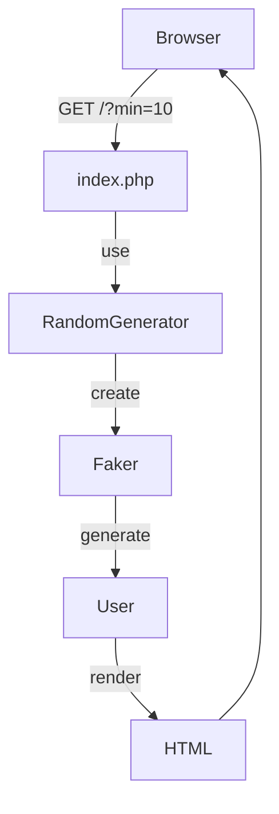

---

# Faker を使ってランダムなユーザー一覧を生成する PHP アプリを作る

## リード文

テストデータやデモ用の画面を作るとき、「それっぽいユーザー情報」を大量に用意したくなることはありませんか？
本記事では **fakerphp/faker** を使ってランダムなユーザー情報を生成し、動的に HTML ページへ表示する簡単な PHP アプリを実装します。

---

## 前提知識

* PHP の基本的な構文（クラス・名前空間）
* Composer を使ったライブラリ管理
* GET パラメータの扱い方
* 簡単な HTML / PHP テンプレート構文

---

## Context（背景）

ユーザー一覧画面や管理画面の UI を作る際、本物の個人情報を使うことはできません。
そこで役立つのが **Faker** です。Faker を使うと、名前・メールアドレス・電話番号などをランダムかつ現実的な形式で生成できます。

今回は以下を目標にします。

* Faker を Composer で導入する
* ランダムな User オブジェクトを生成するヘルパークラスを作成
* 生成したユーザーを動的に HTML として表示する

---

## Core Concept（Faker の基本）

Faker は「ランダムデータ生成ライブラリ」です。

```php
$faker->firstName();
$faker->lastName();
$faker->email;
```

のように、直感的なプロパティやメソッドでダミーデータを生成できます。
利用可能なメソッド一覧は [Faker 公式サイト](https://fakerphp.github.io/) で確認できます。


---

## 実装例①：Faker のインストール

まずは Faker をインストールします。
`user-lorem-ipsum` プロジェクトの **ルートフォルダ**で以下を実行してください。

```bash
composer require fakerphp/faker
```

インストールが完了すると、`vendor` フォルダが作成されます。

PHP のエントリポイント（例：index.php）で以下を記述すれば、Composer の依存関係を自動で読み込めます。

```php
require_once 'vendor/autoload.php';
```

---

## 実装例②：ランダムユーザー生成クラスを作る

次に、ランダムなユーザーを生成するクラスを作成します。

### Helpers/RandomGenerator.php

```php
<?php

namespace Helpers;

use Faker\Factory;
use Models\User;

class RandomGenerator {
    public static function user(): User {
        $faker = Factory::create();

        return new User(
            $faker->randomNumber(),
            $faker->firstName(),
            $faker->lastName(),
            $faker->email,
            $faker->password,
            $faker->phoneNumber,
            $faker->address,
            $faker->dateTimeThisCentury,
            $faker->dateTimeBetween('-10 years', '+20 years'),
            $faker->randomElement(['admin', 'user', 'editor'])
        );
    }

    public static function users(int $min, int $max): array {
        $faker = Factory::create();
        $users = [];
        $numOfUsers = $faker->numberBetween($min, $max);

        for ($i = 0; $i < $numOfUsers; $i++) {
            $users[] = self::user();
        }

        return $users;
    }
}
```

### ポイント

* `Factory::create()` で Faker のインスタンスを生成
* `user()` は User オブジェクトを 1 件生成
* `users()` は最小〜最大数の範囲で複数ユーザーを生成

---

## 実装例③：動的な Web ページを作る

最後に、生成したユーザーを表示するページを作成します。

### index.php

```php
<?php
// コードベースのファイルのオートロード
spl_autoload_extensions(".php");
spl_autoload_register(function($class) {
    $file = __DIR__ . '/'  . str_replace('\\', '/', $class). '.php';
    if (file_exists($file)) include($file);
});

// composerの依存関係のオートロード
require_once 'vendor/autoload.php';

use Helpers\RandomGenerator;

// クエリ文字列からパラメータを取得
$min = $_GET['min'] ?? 5;
$max = $_GET['max'] ?? 20;

// パラメータが整数であることを確認
$min = (int)$min;
$max = (int)$max;

// ユーザーの生成
$users = RandomGenerator::users($min, $max);
?>

<!DOCTYPE html>
<html lang="en">
<head>
    <meta charset="UTF-8">
    <title>User Profiles</title>
</head>
<body>
<h1>User Profiles</h1>

<?php foreach ($users as $user): ?>
    <div class="user-card">
        <?= $user->toHTML(); ?>
    </div>
<?php endforeach; ?>

</body>
</html>
```

### ポイント

* GET パラメータ `min`, `max` を使って生成数を制御
* `User::toHTML()` を呼び出して HTML を動的に生成

---

## 落とし穴・注意点

* Faker は **毎回ランダム**なので、再現性が必要な場合は `seed()` を使う
* 本番環境で Faker を使わない（あくまでテスト・デモ用途）
* パラメータのバリデーションは最低限でも必ず行う

---

## 応用例

* 管理画面のモックデータ生成
* API レスポンスのダミーデータ作成
* E2E テスト用のデータ供給

---

## まとめ

* Faker を使うと、リアルなダミーデータを簡単に生成できる
* Composer + オートロードで管理すると拡張しやすい
* GET パラメータを使えば、柔軟なデモページが作れる

---

## Try It

1. `php -S localhost:8000` でローカルサーバーを起動
2. ブラウザで `http://localhost:8000` にアクセス
3. `http://localhost:8000/?min=10` のようにパラメータを変えてみる
4. User クラスに項目を追加して表示を拡張してみる

## 全体構成図


---


